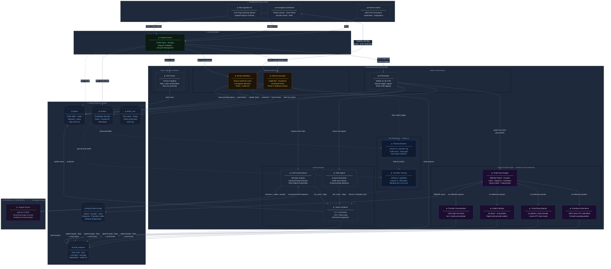

```mermaid
%%{init: {
  "theme": "base",
  "themeVariables": {
    "primaryColor": "#0f172a",
    "primaryTextColor": "#e2e8f0",
    "primaryBorderColor": "#334155",
    "lineColor": "#64748b",
    "secondaryColor": "#1e293b",
    "tertiaryColor": "#0f172a",
    "background": "#020617",
    "nodeBorder": "#475569",
    "clusterBkg": "#1e293b",
    "titleColor": "#94a3b8",
    "edgeLabelBackground": "#1e293b",
    "fontSize": "13px"
  }
}}%%

flowchart TB

    subgraph PRESENTATION["  ⬡  PRESENTATION LAYER"]
        direction LR
        WEB["◈  Investigator Dashboard\n─────────────────────\nReview Queue · Claim Detail\nDecision Panel · Stats"]
        CSV["◈  Data Ingestion UI\n─────────────────────\nCSV Drag-and-Drop Upload\nUpload Progress & Result"]
        EXT["◈  External Clients\n─────────────────────\nREST API Consumers\nAutomation · Integrations"]
    end

    subgraph GATEWAY["  ⬡  API GATEWAY"]
        direction LR
        GW["◈  FastAPI Server\n──────────────────────────\nCORS Policy · Routing\nRequest Validation\nLifecycle Management"]
    end

    subgraph CORE["  ⬡  FRAUD DETECTION CORE"]
        direction TB

        subgraph INGEST_PIPE["  Claim Ingestion Pipeline"]
            PARSER["◈  CSV Parser\n─────────────────\nColumn mapping\nDate / code normalisation\nRaw row archiving"]
        end

        subgraph SCORING["  Scoring Engine"]
            direction LR
            LLM_AN["◈  LLM Fraud Analyzer\n──────────────────────\nNarrative analysis\nStructured flag extraction\nPlain-English explanation"]
            RULE_EN["◈  Rule Engine\n──────────────────────\nAmount thresholds\nCode-count checks\nTiming anomaly detection"]
            COMBINER["◈  Score Combiner\n──────────────────────\n0.7 × LLM score\n+ 0.3 × Rule score\nRisk level assignment"]
        end

        subgraph BATCH["  Batch Orchestration"]
            SCHED["◈  APScheduler\n─────────────────\nNightly run @ 2 AM\nManual trigger support\nBatch audit logging"]
        end

        subgraph GRAPH_ENGINE["  Patient Profile Graph  — Network Fraud Detection"]
            direction LR
            GSYNC["◈  Graph Sync Engine\n──────────────────────\nMERGE Patient · Provider\nClaim · Diagnosis · Procedure\nUpsert nodes + relationships"]
            Q_CONC["◈  Provider Concentration\n──────────────────────\n>40% high-risk claims\nmin 2 claims per provider"]
            Q_VEL["◈  Patient Velocity\n──────────────────────\n≥5 claims · ≥3 providers\nRapid multi-provider pattern"]
            Q_RING["◈  Fraud Ring Detector\n──────────────────────\n≥2 patients: same provider\n+ same CPT code cluster"]
            Q_DOM["◈  Procedure Dominance\n──────────────────────\n>80% same CPT code billed\nProvider upcoding pattern"]
        end

        subgraph HITL["  Human-in-the-Loop"]
            REVIEW["◈  Review Workflow\n─────────────────\nQueue ranked by score\nInvestigator decisions\nNotes + audit trail"]
            LABELS["◈  Label Accumulator\n─────────────────\nLegitimate · Suspicious\nConfirmed Fraud\nPhase 2 readiness tracker"]
        end

        subgraph ML_PREP["  ML Readiness  — Phase 2"]
            FEAT["◈  Feature Extractor\n──────────────────────\nAmount vs. provider avg\nCode count · timing gap\nClaim-type indicators"]
            TRAIN["◈  Classifier Training\n──────────────────────\nXGBoost / LightGBM\nUnlocks at ~500 labels\nBlended with LLM score"]
        end
    end

    subgraph STORAGE["  ⬡  PERSISTENCE LAYER"]
        direction LR
        CLAIMS_TBL[("◈  claims\n────────────────\nClaim fields · codes\nNarrative · status\nRaw CSV row")]
        ANALYSIS_TBL[("◈  fraud_analyses\n────────────────\nRisk score · level\nLLM flags · rule flags\nExplanation · model ver")]
        REVIEWS_TBL[("◈  reviews\n────────────────\nInvestigator decision\nNotes · reviewer ID\nTimestamp")]
        BATCH_TBL[("◈  batch_runs\n────────────────\nRun status · timing\nClaims processed\nError log")]
        NEO4J_GRAPH[("◈  Neo4j Patient Graph\n────────────────\nPatient · Provider · Claim\nDiagnosis · Procedure nodes\nNetwork relationships")]
    end

    subgraph EXT_AI["  ⬡  EXTERNAL AI INFERENCE  ─ ─ ─ ─ (managed cloud)"]
        direction LR
        GEMINI["◈  Google Gemini\n──────────────────────\ngemini-2.5-flash\nStructured output via tools\nHealthcare fraud prompts"]
    end

    %% ── Ingestion Flow ───────────────────────────────────────────
    WEB   -->|"POST /claims/upload"| GW
    CSV   -->|"multipart CSV"| GW
    EXT   -->|"REST"| GW
    GW    -->|"parse & store"| PARSER
    PARSER -->|"insert rows"| CLAIMS_TBL

    %% ── Batch Flow ───────────────────────────────────────────────
    GW    -->|"POST /batch/run\n(manual trigger)"| SCHED
    SCHED -->|"query pending claims"| CLAIMS_TBL
    SCHED -->|"analyze each claim"| LLM_AN
    SCHED -->|"check rule signals"| RULE_EN
    LLM_AN -->|"llm_score + flags"| COMBINER
    RULE_EN -->|"rule_score + flags"| COMBINER
    COMBINER -->|"write analysis"| ANALYSIS_TBL
    COMBINER -->|"update status → analyzed"| CLAIMS_TBL
    SCHED -->|"write run record"| BATCH_TBL

    %% ── LLM external call ────────────────────────────────────────
    LLM_AN -->|"narrative + codes + prompt"| GEMINI
    GEMINI -->|"structured JSON response"| LLM_AN

    %% ── Review Flow ──────────────────────────────────────────────
    GW    -->|"GET /review/queue"| REVIEW
    REVIEW -->|"read analyses"| ANALYSIS_TBL
    REVIEW -->|"read claims"| CLAIMS_TBL
    GW    -->|"POST /review/{id}/decision"| LABELS
    LABELS -->|"insert review"| REVIEWS_TBL
    LABELS -->|"update status → reviewed"| CLAIMS_TBL

    %% ── ML Phase 2 ───────────────────────────────────────────────
    LABELS -.->|"500+ labels trigger"| FEAT
    CLAIMS_TBL -.->|"structured fields"| FEAT
    FEAT -.->|"feature vectors"| TRAIN
    REVIEWS_TBL -.->|"ground truth labels"| TRAIN
    TRAIN -.->|"Phase 2: blended score"| COMBINER

    %% ── Graph Enrichment Flow (Pass 2) ──────────────────────────
    SCHED -->|"graph sync pass\n(post-batch)"| GSYNC
    GSYNC <-->|"MERGE upsert"| NEO4J_GRAPH
    GSYNC -->|"run detection queries"| Q_CONC
    GSYNC -->|"run detection queries"| Q_VEL
    GSYNC -->|"run detection queries"| Q_RING
    GSYNC -->|"run detection queries"| Q_DOM
    Q_CONC -->|"append graph_ flags\n+ score boost"| ANALYSIS_TBL
    Q_VEL  -->|"append graph_ flags\n+ score boost"| ANALYSIS_TBL
    Q_RING -->|"append graph_ flags\n+ score boost"| ANALYSIS_TBL
    Q_DOM  -->|"append graph_ flags\n+ score boost"| ANALYSIS_TBL
    REVIEW -->|"network_risk flag\n(graph_ prefix detection)"| WEB

    %% ── Health ───────────────────────────────────────────────────
    GW    -.->|"GET /health"| CLAIMS_TBL

    %% ── Stats ────────────────────────────────────────────────────
    GW    -->|"GET /review/stats"| REVIEWS_TBL

    %% ── Styles ───────────────────────────────────────────────────
    classDef node     fill:#1e293b,stroke:#475569,color:#e2e8f0,rx:6
    classDef storage  fill:#172033,stroke:#3b4f6b,color:#93c5fd,rx:6
    classDef extai    fill:#1a1225,stroke:#6d28d9,color:#c4b5fd,rx:6
    classDef gateway  fill:#0c1a12,stroke:#166534,color:#86efac,rx:6
    classDef hitl     fill:#1c1408,stroke:#b45309,color:#fcd34d,rx:6
    classDef ml       fill:#0f1a2e,stroke:#1d4ed8,color:#93c5fd,rx:6
    classDef netgraph fill:#1a0d2e,stroke:#6d28d9,color:#ede9fe,rx:6

    class GW gateway
    class WEB,CSV,EXT,PARSER,LLM_AN,RULE_EN,COMBINER,SCHED node
    class REVIEW,LABELS hitl
    class FEAT,TRAIN ml
    class CLAIMS_TBL,ANALYSIS_TBL,REVIEWS_TBL,BATCH_TBL,NEO4J_GRAPH storage
    class GEMINI extai
    class GSYNC,Q_CONC,Q_VEL,Q_RING,Q_DOM netgraph
```
