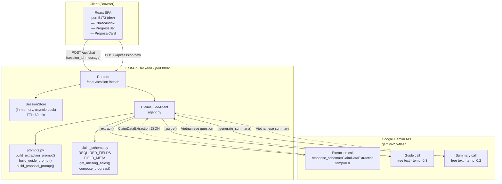
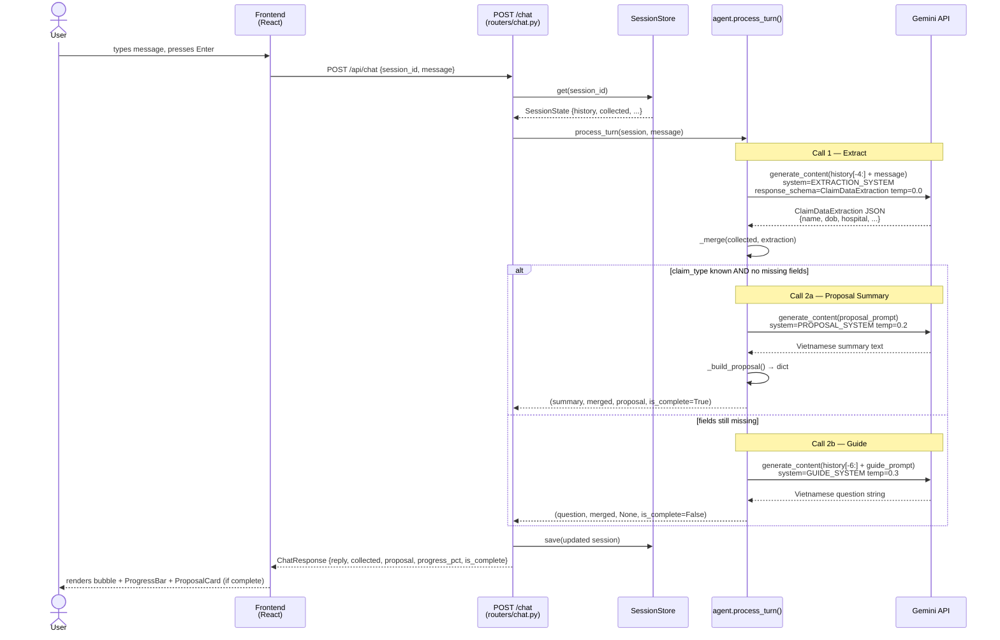
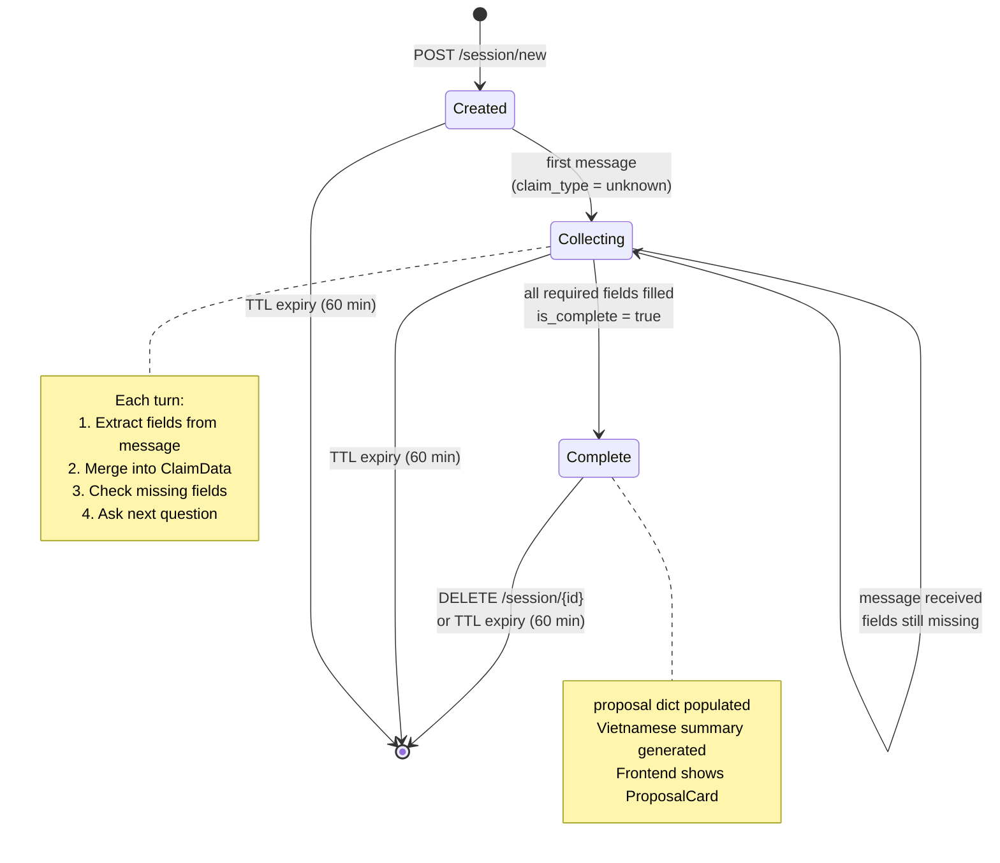
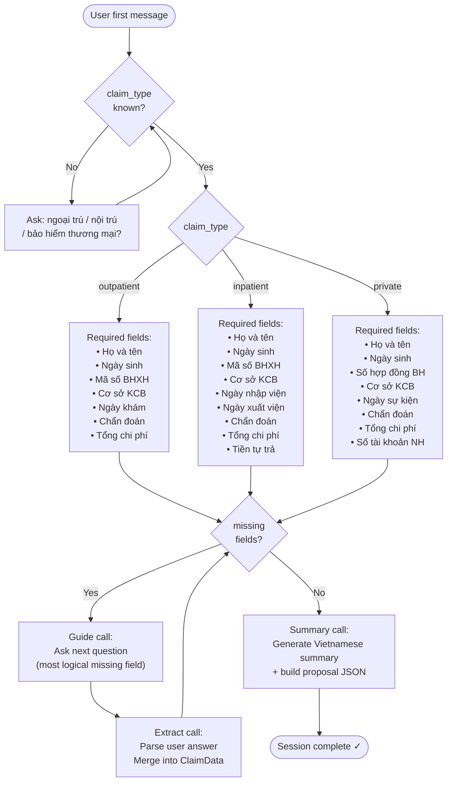
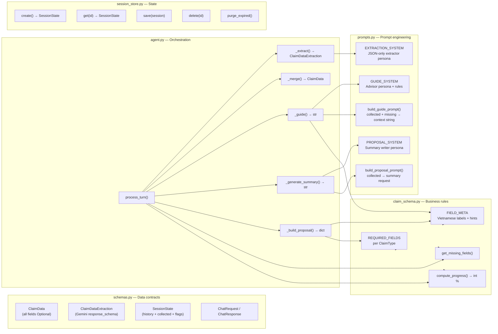
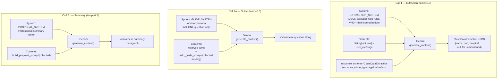

# High-Level Design — Insurance Claim Guide Virtual Assistant

---

## 1. System Architecture

---

## 2. Per-Turn Data Flow (Sequence Diagram)

---

## 3. Session State Machine

---

## 4. Claim Type Decision & Required Fields

---

## 5. Component Responsibilities

---

## 6. Prompt Architecture

