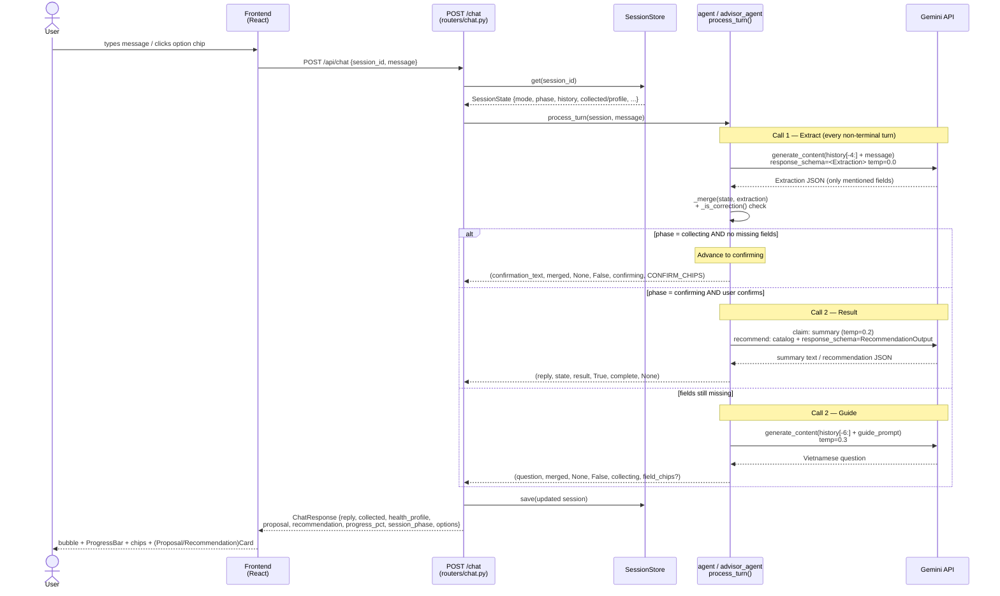
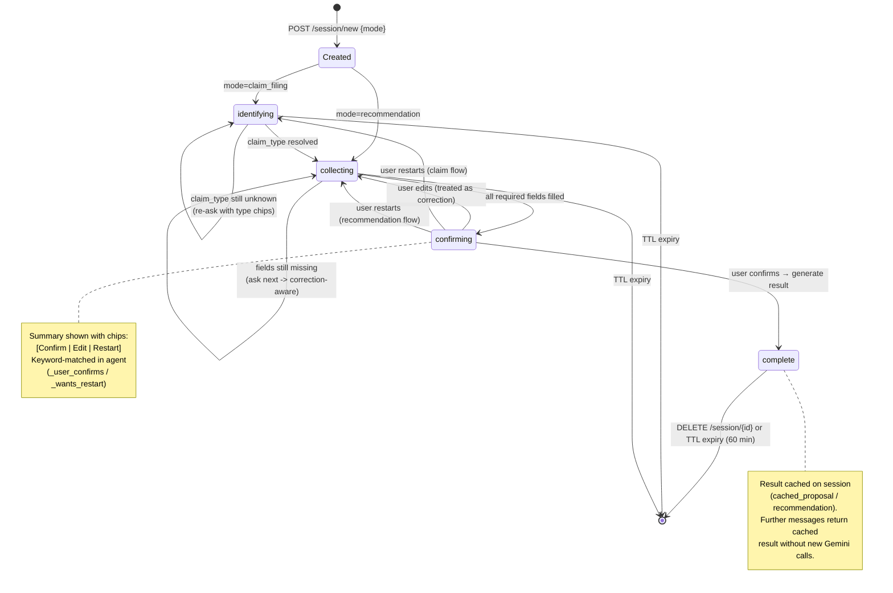
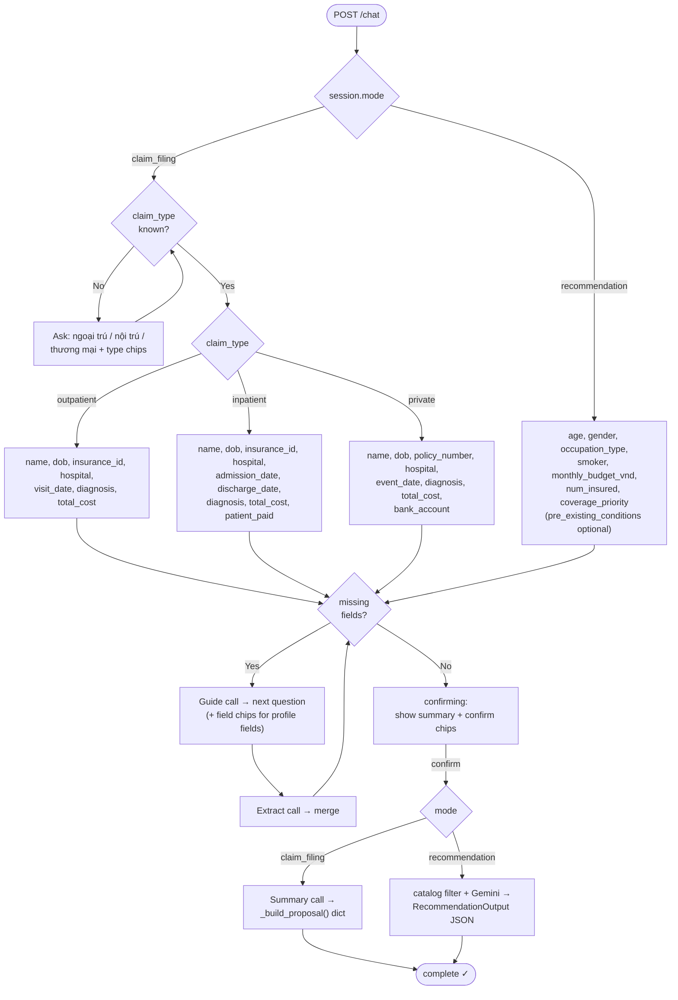
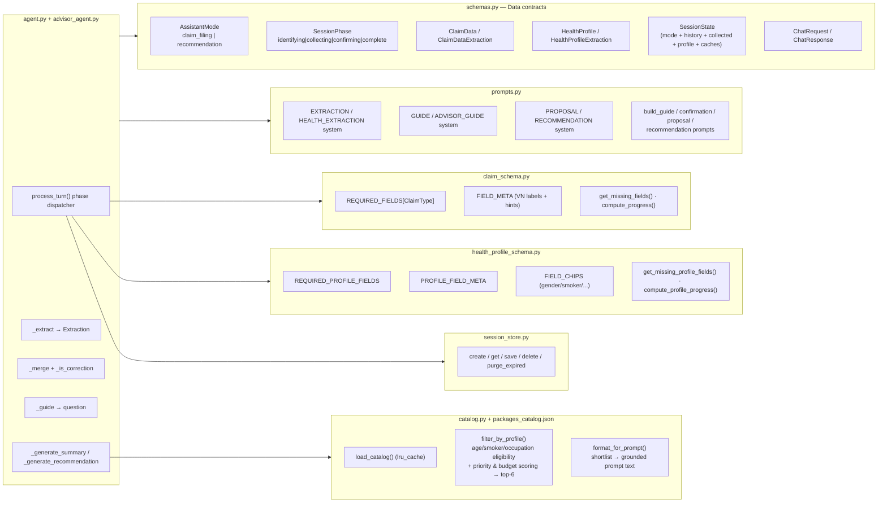
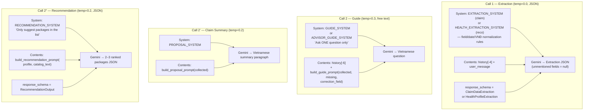

# High-Level Design — Insurance Guide Virtual Assistant

A two-mode conversational insurance assistant for the Vietnamese market:

| Mode | `AssistantMode` | Agent | Outcome |
|---|---|---|---|
| **Claim filing** (khai thác bảo hiểm) | `claim_filing` | `agent.py` | Structured BHYT / commercial claim dossier (`ProposalCard`) |
| **Package recommendation** (tư vấn gói bảo hiểm) | `recommendation` | `advisor_agent.py` | 2–3 catalog-grounded package suggestions (`RecommendationCard`) |

Both modes share the same backbone — a per-turn **extract → merge → guide** loop driven by Gemini structured output, a 4-state session machine, and an in-memory session store. They diverge only in their data schema, prompts, and final-result generation.

---

## 1. System Architecture

```mermaid
graph TB
    subgraph Client["Client (Browser) — React SPA · port 5173 (dev)"]
        MS["ModeSelector\n(choose mode)"]
        Chat["ChatWindow\n+ OptionChips\n+ ProgressBar"]
        PC["ProposalCard\n(claim result)"]
        RC["RecommendationCard\n(recommendation result)"]
    end

    subgraph Backend["FastAPI Backend  ·  port 8002"]
        direction TB
        RSession["session router\nPOST /session/new {mode}\nDELETE /session/{id}"]
        RChat["chat router\nPOST /chat\n(dispatch by mode)"]
        RHealth["health router\nGET /health"]
        Store["SessionStore\n(in-memory, asyncio.Lock)\nTTL: 60 min"]

        ClaimAgent["agent.py\nClaim flow\nextract → guide → proposal"]
        AdvisorAgent["advisor_agent.py\nRecommendation flow\nextract → guide → recommend"]

        ClaimSchema["claim_schema.py\nREQUIRED_FIELDS · FIELD_META"]
        ProfileSchema["health_profile_schema.py\nREQUIRED_PROFILE_FIELDS · FIELD_CHIPS"]
        Catalog["catalog.py + packages_catalog.json\nfilter_by_profile() · format_for_prompt()"]
        Prompts["prompts.py\nsystem prompts + builders\n(both flows)"]

        RChat --> Store
        RChat -->|"mode=claim_filing"| ClaimAgent
        RChat -->|"mode=recommendation"| AdvisorAgent
        ClaimAgent --> ClaimSchema & Prompts
        AdvisorAgent --> ProfileSchema & Prompts & Catalog
    end

    subgraph Gemini["Google Gemini API · gemini-2.5-flash"]
        E["Extract call\nresponse_schema=<Extraction>\ntemp=0.0"]
        G["Guide call\nfree text · temp=0.3"]
        Rsum["Claim summary\nfree text · temp=0.2"]
        Rrec["Recommendation\nresponse_schema=RecommendationOutput\ntemp=0.2"]
    end

    MS -->|"POST /api/session/new {mode}"| RSession
    Chat -->|"POST /api/chat {session_id, message}"| RChat
    ClaimAgent -->|"_extract / _guide / _generate_summary"| E & G & Rsum
    AdvisorAgent -->|"_extract / _guide / _generate_recommendation"| E & G & Rrec
    RChat -.->|"ChatResponse"| Chat
    RChat -.->|"proposal"| PC
    RChat -.->|"recommendation"| RC
```



All routes are registered twice — bare (`/chat`) and under `/api` (`/api/chat`). The Vite dev proxy forwards `/api/*` to `localhost:8002`.

### LLM provider layer (`llm.py`)

Both agents call the model only through `app/llm.py`, which exposes one interface
(`generate_text` / `generate_structured`) implemented by two interchangeable
providers, selected by the `LLM_PROVIDER` setting:

| Provider | SDK | Structured output | Roles |
|---|---|---|---|
| **Gemini** (default) | `google-genai` | native `response_schema=<PydanticModel>` | `user` / `model` |
| **SiliconFlow** | `openai` (base_url `…siliconflow.cn/v1`) | `response_format=json_object` + JSON schema injected into the system prompt, tolerant parsing | `model`→`assistant`, separate `system` |

Agents pass the canonical message shape `{"role": "user"|"model", "content": str}`
(matching `session.history`); each provider adapts it to its SDK. One provider is
active per process (`get_provider()` singleton), and it raises a clear error if the
selected provider's API key is missing.

---

## 2. Per-Turn Data Flow (Sequence Diagram)

The chat router selects an agent by `session.mode`; both agents expose the same `process_turn()` signature, so the router code is symmetric.



---

## 3. Session State Machine (`SessionPhase`)

A single 4-state machine serves both modes. The only difference: claim filing starts in `identifying` (claim type unknown); recommendation skips straight to `collecting` (set in `session.py` at creation).



---

## 4. Mode Dispatch & Required Fields



---

## 5. Component Responsibilities



---

## 6. Prompt Architecture

Each agent issues up to two Gemini calls per turn. Extraction is constrained JSON (`response_schema`); guidance is free text. The terminal call differs by mode.



---

## 7. Catalog Grounding (Recommendation Flow)

The recommendation agent does **not** rely on the model's open-world knowledge of insurers. It grounds every suggestion in a local catalog (`packages_catalog.json`, 12 fictional packages across An Tín, Trường Phúc Life, Minh An Life, Việt Khang Life, Hồng Ân, …):

1. **Load** — `load_catalog()` reads + caches the JSON (`lru_cache`).
2. **Filter** — `filter_by_profile()` applies hard eligibility rules (age range, smoker exclusion, excluded occupations), then scores survivors by coverage-priority overlap (×10) and budget fit (+5/+2), returning the top 6.
3. **Format** — `format_for_prompt()` renders the shortlist (with the best budget-matching tier per package) into structured prompt text.
4. **Constrain** — `RECOMMENDATION_SYSTEM` forbids inventing packages/insurers/premiums outside the supplied list; `response_schema=RecommendationOutput` enforces the output shape.
5. **Fallback** — if the filter yields nothing, the first 6 catalog packages are passed instead (logged as a warning).

```
Catalog package schema (top-level keys)
├── insurer, name, product_line
├── coverage_types[]                 # nội trú / ngoại trú / tai nạn / ...
├── monthly_premium_tiers[]          # { plan, budget_max_vnd, sum_insured_vnd }
├── eligibility                      # { min_age, max_age, excludes_smoker, excluded_occupations[] }
├── key_benefits_vi[], exclusions_vi[]
└── description_vi
```

This keeps recommendations auditable and product-accurate while still letting Gemini handle ranking, suitability reasoning, and Vietnamese phrasing.

---

## 8. Key Design Notes

- **Stateless agents, stateful store.** Agents are pure functions of `(session, message)`; all persistence lives in `SessionStore` (in-memory dict guarded by `asyncio.Lock`, 60-min TTL). No database — this is a lab.
- **Correction handling.** `_is_correction()` compares pre/post-merge state; if a previously-set field changed, the guide prompt acknowledges the update before asking the next question, and "continue / edit more" chips are offered.
- **Result caching.** Once `complete`, the cached `proposal` / `recommendation` is returned on subsequent turns with no further Gemini calls.
- **Resilient extraction.** Extraction failures are caught and degrade to an empty patch, so a bad parse never breaks the turn — the agent simply re-asks.
- **Single source of truth for fields.** Required fields, Vietnamese labels, and option chips live in `claim_schema.py` / `health_profile_schema.py`; adding a field or claim type is a localized change (see README "Mở rộng").
