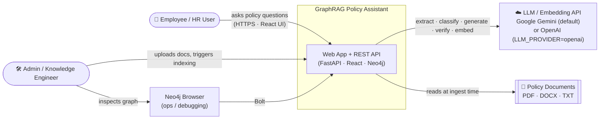
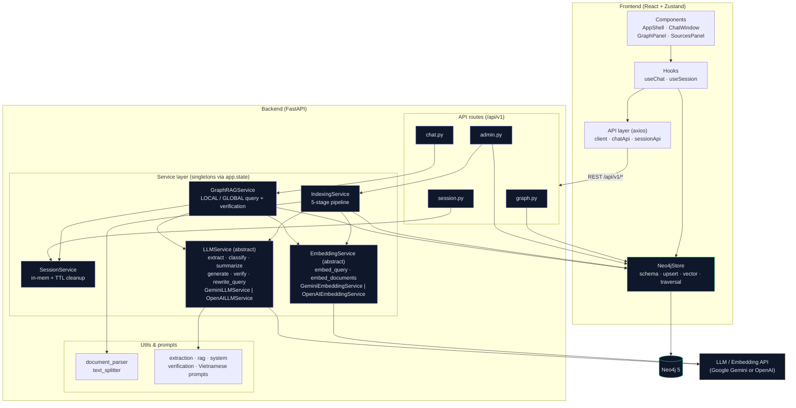
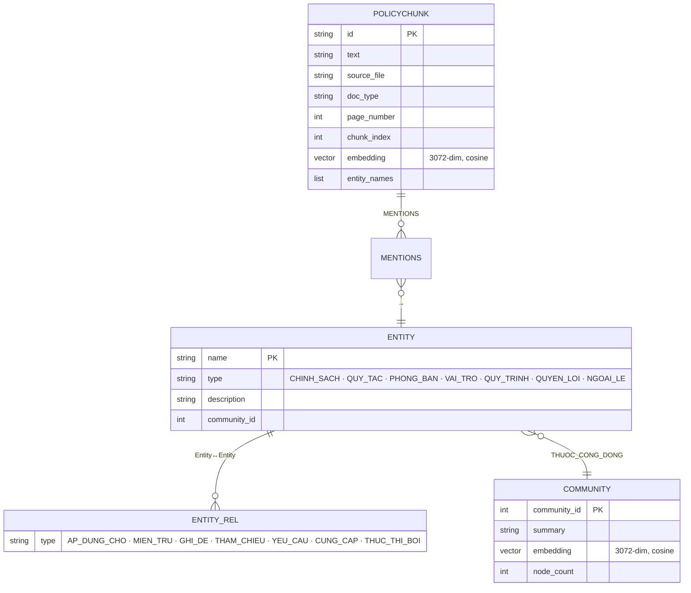
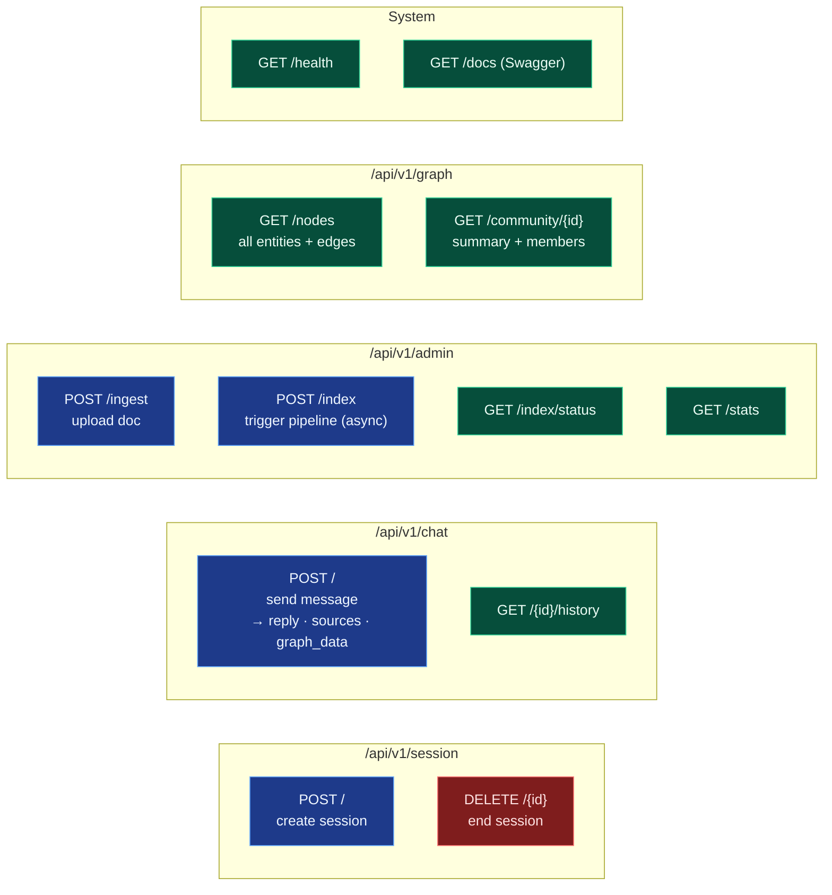
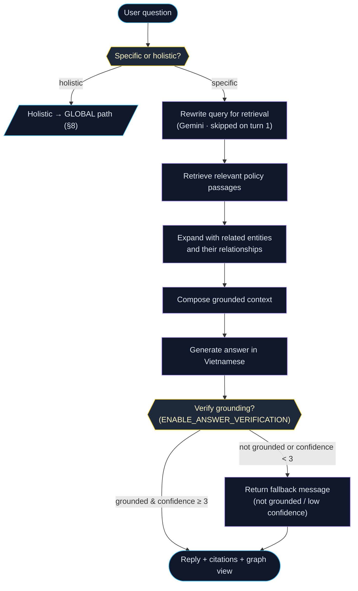
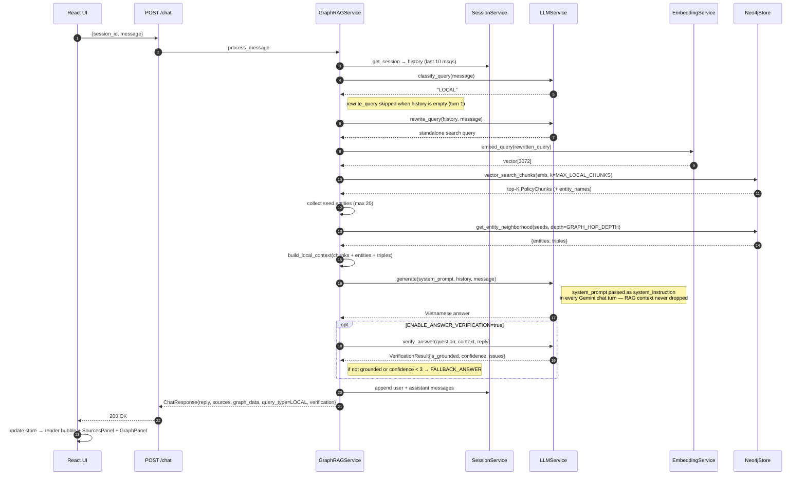
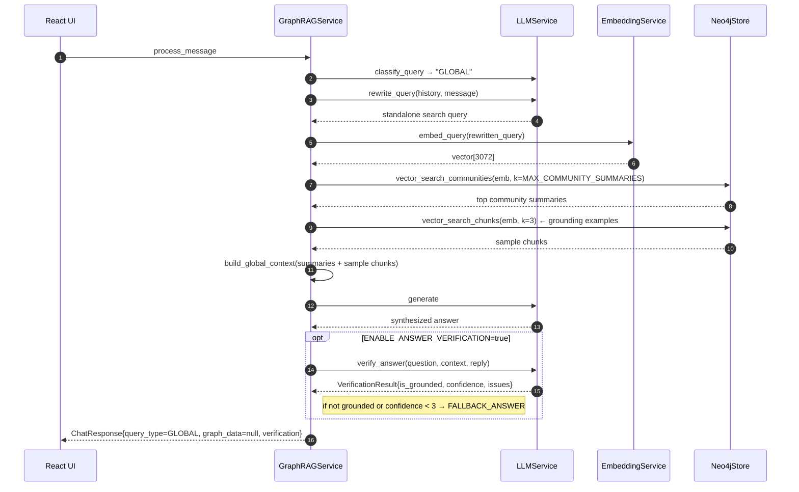
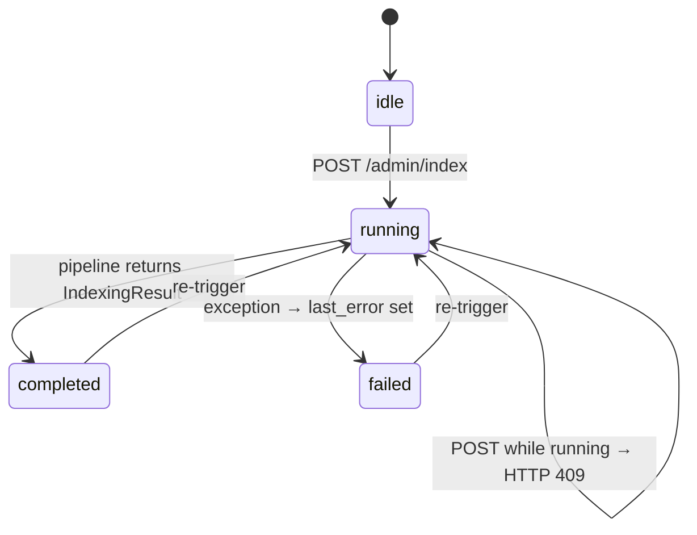
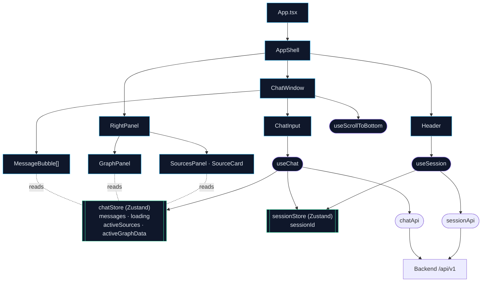

# High-Level Design — GraphRAG Policy Assistant

This document captures the high-level design of the **Agentic House Policy Assistant**, a Graph-RAG system that answers questions about company HR policies in Vietnamese.

All diagrams are written in [Mermaid](https://mermaid.js.org/) and render directly on GitHub / VS Code.

> Source files referenced:
> - Backend entrypoint: [backend/app/main.py](../backend/app/main.py)
> - Indexing pipeline: [backend/app/services/indexing_service.py](../backend/app/services/indexing_service.py)
> - Query engine: [backend/app/services/graph_rag_service.py](../backend/app/services/graph_rag_service.py)
> - Graph + vector store: [backend/app/services/neo4j_store.py](../backend/app/services/neo4j_store.py)
> - LLM / embedding provider abstraction: [backend/app/services/llm_service.py](../backend/app/services/llm_service.py), [backend/app/services/embedding_service.py](../backend/app/services/embedding_service.py)
> - Answer verification prompts: [backend/app/prompts/verification_prompts.py](../backend/app/prompts/verification_prompts.py)
> - Deployment: [docker-compose.yml](../docker-compose.yml)

---

## 1. System Context (C4 Level 1)

Shows the system as a single box and the external actors / systems it talks to.



---

## 2. Deployment View (Docker Compose)

Runtime topology as defined in [docker-compose.yml](../docker-compose.yml).

```mermaid
flowchart TB
    classDef ext fill:#1e293b,stroke:#fb923c,color:#e2e8f0

    user["🌐 Browser"]

    subgraph host["🖥️ Docker Host"]
        subgraph fe["frontend (nginx :80)"]
            react["React 18 + Vite build\nstatic assets · /api proxy"]
        end

        subgraph be["backend (uvicorn :8000)"]
            fastapi["FastAPI app\nlifespan singletons:\nSessionService · EmbeddingService\nLLMService · IndexingService\nGraphRAGService · Neo4jStore"]
            volraw[["volume: ./backend/data\n(raw policy docs)"]]
        end

        subgraph db["neo4j 5 (:7474 / :7687)"]
            graph["Graph DB + Vector Indexes\n(APOC plugin)"]
            volneo[["volume: neo4j_data"]]
        end
    end

    llmapi["☁️ LLM / Embedding API\n(Gemini or OpenAI\nper LLM_PROVIDER env)"]:::ext

    user -- ":5173 (HTTP)" --> fe
    fe -- "/api/v1/* reverse proxy" --> be
    be -- "Bolt :7687" --> db
    be -- "HTTPS REST" --> llmapi
    be --- volraw
    db --- volneo
```

**Healthchecks & startup ordering**
- `neo4j` exposes a `cypher-shell RETURN 1` healthcheck; `backend` waits on `service_healthy`.
- `backend` exposes `GET /health`; `frontend` waits on it before starting nginx.

---

## 3. Container / Module Decomposition (C4 Level 2)



---

## 4. Knowledge Data Model (Neo4j schema)

Derived from [neo4j_store.py:34-64](../backend/app/services/neo4j_store.py#L34-L64) and [README — Schema Neo4j](../README.md#schema-neo4j).



**Constraints & indexes**

| Object | Type | Purpose |
|--------|------|---------|
| `entity_name` | UNIQUE constraint on `Entity.name` | de-duplicates entities by canonical name |
| `chunk_id` | UNIQUE constraint on `PolicyChunk.id` | idempotent upsert during indexing |
| `community_id` | UNIQUE constraint on `Community.community_id` | one node per Louvain community |
| `policy_chunks` | VECTOR INDEX on `PolicyChunk.embedding` (cosine, 3072 dims) | LOCAL search |
| `community_summaries` | VECTOR INDEX on `Community.embedding` (cosine, 3072 dims) | GLOBAL search |

---

## 5. API Surface



---

## 6. Sequence — Indexing Pipeline

End-to-end ingestion of policy docs into the graph. Triggered by `POST /api/v1/admin/index` (async task) or the offline CLI `scripts/build_graph_index.py`.

```mermaid
sequenceDiagram
    autonumber
    participant Admin
    participant API as POST /admin/index
    participant Idx as IndexingService
    participant FS as Filesystem<br/>(data/raw)
    participant LLM as LLMService
    participant Emb as EmbeddingService
    participant N4J as Neo4jStore

    Admin->>API: trigger
    API->>Idx: run_full_pipeline (background task)
    Idx->>N4J: clear() — wipe graph

    rect rgb(30,41,59)
    note right of Idx: Stage 1 — Parse & chunk
    Idx->>FS: walk handbooks/hr_policies/conduct/benefits/procedures
    FS-->>Idx: PDF/DOCX/TXT pages
    Idx->>Idx: split_text (≈2800 chars/chunk)
    end

    rect rgb(30,41,59)
    note right of Idx: Stage 2 — Extract entities + relations
    loop for each chunk (batched)
        Idx->>LLM: extract_entities_and_relations(text)
        LLM-->>Idx: {entities, relations}
        Idx->>N4J: upsert_entity × N
        Idx->>N4J: upsert_relationship × M
    end
    end

    rect rgb(30,41,59)
    note right of Idx: Stage 3 — Embed chunks
    loop for each chunk
        Idx->>Emb: embed_documents([text])
        Emb-->>Idx: vector[3072]
        Idx->>N4J: upsert_chunk + link_chunk_to_entity (MENTIONS)
    end
    end

    rect rgb(30,41,59)
    note right of Idx: Stage 4 — Community detection (python-louvain)
    Idx->>N4J: get_all_entities_and_edges()
    Idx->>Idx: build networkx graph + best_partition
    loop for each entity
        Idx->>N4J: set_entity_community(name, comm_id)
    end
    end

    rect rgb(30,41,59)
    note right of Idx: Stage 5 — Summarize eligible communities (≥3 nodes)
    loop for each community
        Idx->>LLM: generate_community_summary(nodes, edges)
        LLM-->>Idx: summary text
        Idx->>Emb: embed_documents([summary])
        Idx->>N4J: upsert_community + THUOC_CONG_DONG edges
    end
    end

    Idx-->>API: IndexingResult (counts)
    API-->>Admin: status = completed
```



---

## 7. Chat Query (LOCAL)

The default path for specific, entity-grounded questions. Source: [`GraphRAGService._local_search`](../backend/app/services/graph_rag_service.py#L65-L84).

### 7a. Flowchart — conceptual view



### 7b. Sequence — timing view



---

## 8. Sequence — Chat Query (GLOBAL)

For holistic / comparative questions ("summarize all benefits").



> GLOBAL path returns `graph_data=null` — the GraphPanel falls back to an empty / dimmed state.

---

## 9. State — Indexing Job Lifecycle

Tracked in `app.state.indexing_status` and polled by the UI via `GET /api/v1/admin/index/status`.



Stages emitted by `progress_callback`:
`parsing` → `extracting` → `embedding_chunks` → `community_detection` → `summarizing`.

---

## 10. Frontend Component Tree & Data Flow



---

## 11. Cross-cutting Concerns

| Concern | Where it lives | Notes |
|---|---|---|
| **Configuration** | [backend/app/config.py](../backend/app/config.py) + `.env` | Pydantic `Settings`; one source of truth |
| **LLM Provider Abstraction** | `LLMService` (ABC) + `GeminiLLMService` / `OpenAILLMService`; `create_llm_service()` factory | Swap `LLM_PROVIDER=openai` in `.env` — no code changes needed. Same interface for both. |
| **Embedding Provider Abstraction** | `EmbeddingService` (ABC) + provider implementations; `create_embedding_service()` factory | Provider is selected at startup and baked into the Neo4j vector index dimensions. Switching providers requires re-indexing. |
| **Answer Verification** | `GraphRAGService.process_message` → `LLMService.verify_answer`; [verification_prompts.py](../backend/app/prompts/verification_prompts.py) | Controlled by `ENABLE_ANSWER_VERIFICATION` (default `true`). Scores grounding (bool) + confidence (1–5). Answers with `confidence < 3` or `is_grounded=false` are replaced with `FALLBACK_ANSWER`. |
| **DI / lifecycle** | [backend/app/main.py — lifespan](../backend/app/main.py#L47-L98) | Singletons attached to `app.state`; resolved via [dependencies.py](../backend/app/dependencies.py) |
| **CORS** | `main.create_app` | Allowed origins from `CORS_ORIGINS` |
| **Logging** | `structlog` across all services | Structured JSON logs |
| **Session TTL** | `SessionService.start_cleanup()` | Background task purges expired sessions |
| **Idempotent indexing** | `Neo4jStore` MERGE + `clear()` at pipeline start | Safe to re-run |
| **Rate limiting (LLM)** | `IndexingService` — `asyncio.sleep(1.0)` between batches | Avoids LLM API quota bursts during batch extraction |
| **Vector index dims** | `EMBEDDING_DIM` (default 3072) | Must match the active embedding model; baked into Neo4j vector index at first `build_graph_index` run |
| **Multi-turn query rewriting** | `GraphRAGService.process_message` → `LLMService.rewrite_query(history, message)` | Before embedding, Gemini rewrites vague follow-up questions into a standalone, context-rich search query. No-op on turn 1 (empty history) to avoid unnecessary latency. Falls back to the original message on error. |
| **History windowing** | `GraphRAGService.process_message` — `session.messages[-10:]` | Only the last 10 messages (5 turns) are passed to the LLM, preventing context bloat and conflicting information from stale conversation turns. |
| **Gemini system instruction** | `GeminiLLMService.generate()` — `system_instruction` in `chats.create()` config | The RAG context (system prompt) is passed as `system_instruction` on every chat turn, ensuring policy documents are visible to the model on turn 2+ as well as turn 1. |

---

## 12. Open Considerations

These are not implemented but are natural extensions worth diagramming when added:

- **Auth** — currently no authentication; all routes are open. A reverse proxy or API key middleware would slot in front of the FastAPI app.
- **Session persistence** — sessions live in-process memory and are lost on restart. Redis would replace `SessionService` storage transparently.
- **Multi-tenant graphs** — single shared Neo4j database; a tenant property + filtered indexes would be needed for isolation.
- **Streaming responses** — `/chat` returns the full reply at once. SSE/WebSocket would change the sequence diagrams in §7–8.
