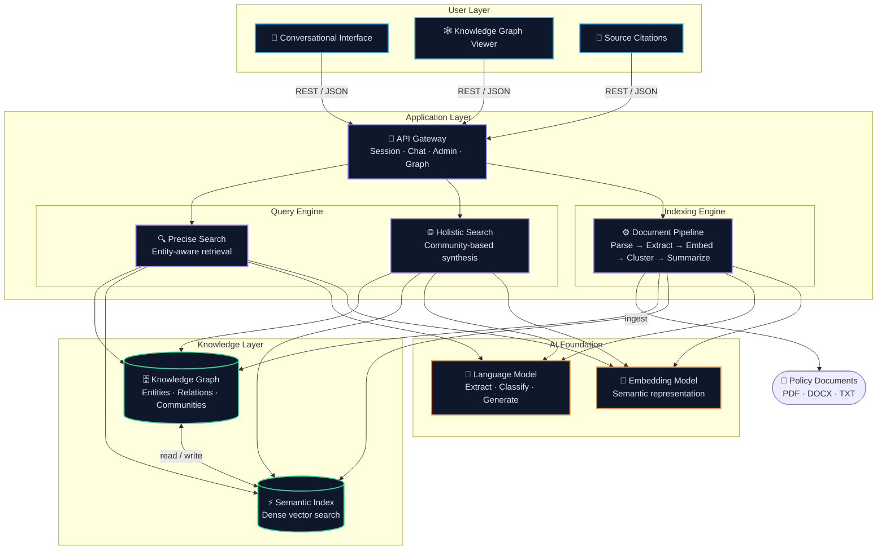
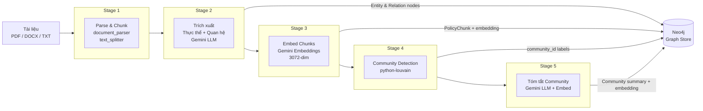
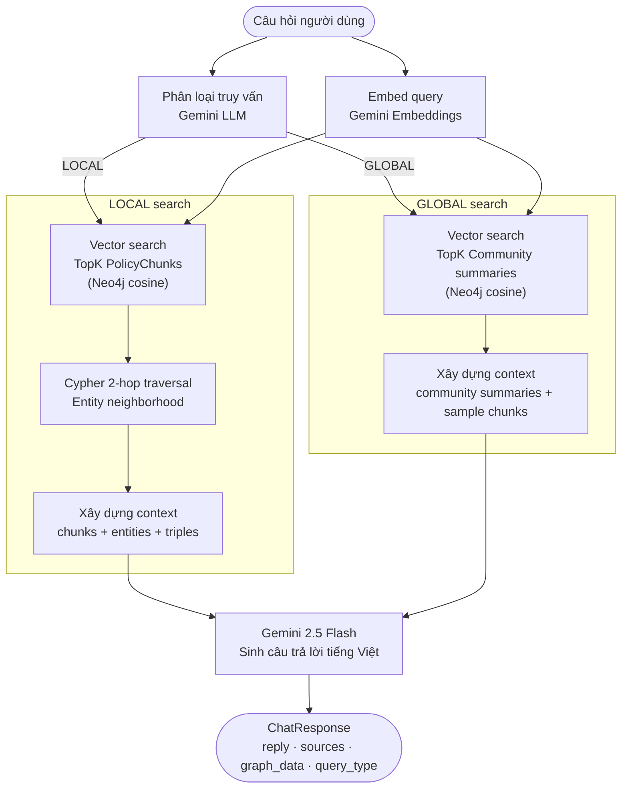

# Trợ Lý Nội Quy Công Ty – Agentic House

Hệ thống hỏi đáp thông minh về nội quy và chính sách công ty, được xây dựng bằng **Graph RAG** (Retrieval-Augmented Generation với đồ thị tri thức). Khác với hệ thống tìm kiếm thông thường, Graph RAG hiểu được **mối quan hệ** giữa các chính sách, phòng ban, vai trò và quy trình.

---

## Kiến trúc hệ thống

### Tổng quan hệ thống



### Pipeline lập chỉ mục (5 giai đoạn)



### Luồng truy vấn (LOCAL / GLOBAL)



### Loại truy vấn

| Loại | Khi nào | Cách hoạt động |
|------|---------|----------------|
| **LOCAL** | Câu hỏi cụ thể (số ngày phép, trang phục theo phòng ban) | Vector search chunks → Cypher 2-hop traversal → câu trả lời với trích dẫn |
| **GLOBAL** | Câu hỏi tổng quan, tóm tắt, so sánh nhiều chính sách | Vector search community summaries → câu trả lời tổng hợp |

---

## Tech Stack

| Tầng | Công nghệ |
|------|-----------|
| Backend | FastAPI + Uvicorn (Python 3.12) |
| LLM | Google Gemini 2.5 Flash |
| Embeddings | `models/gemini-embedding-exp-03-07` (3072 dims) |
| Đồ thị + Vector Store | **Neo4j 5** (thay thế cả ChromaDB + NetworkX) |
| Community Detection | python-louvain (kết quả ghi vào Neo4j) |
| Frontend | React 18 + TypeScript + Vite + Tailwind CSS |
| State | Zustand |
| Container | Docker + Docker Compose |

---

## Cấu trúc dự án

```
graphrag-assistant/
├── backend/
│   ├── app/
│   │   ├── main.py                    # FastAPI app + khởi động dịch vụ
│   │   ├── config.py                  # Cấu hình từ .env
│   │   ├── dependencies.py            # FastAPI dependency injection
│   │   ├── api/routes/
│   │   │   ├── session.py             # POST/DELETE /session
│   │   │   ├── chat.py                # POST /chat, GET /chat/{id}/history
│   │   │   ├── admin.py               # POST /index, GET /stats, POST /ingest
│   │   │   └── graph.py               # GET /graph/nodes, GET /graph/community/{id}
│   │   ├── models/                    # Pydantic schemas
│   │   ├── services/
│   │   │   ├── llm_service.py         # Gemini: extract, classify, answer
│   │   │   ├── embedding_service.py   # Gemini embeddings
│   │   │   ├── neo4j_store.py         # Neo4j: đồ thị + vector index (KEY FILE)
│   │   │   ├── indexing_service.py    # Pipeline lập chỉ mục 5 giai đoạn
│   │   │   ├── graph_rag_service.py   # LOCAL / GLOBAL query pipeline
│   │   │   └── session_service.py     # In-memory sessions
│   │   ├── prompts/                   # Prompts tiếng Việt
│   │   └── utils/                     # Document parser + text splitter
│   ├── data/raw/
│   │   ├── handbooks/                 # Sổ tay nhân viên
│   │   ├── hr_policies/               # Chính sách nhân sự
│   │   ├── conduct/                   # Quy tắc ứng xử, trang phục
│   │   ├── benefits/                  # Phúc lợi
│   │   └── procedures/                # Quy trình
│   ├── scripts/
│   │   └── build_graph_index.py       # CLI lập chỉ mục offline
│   ├── requirements.txt
│   ├── Dockerfile
│   └── .env.example
├── frontend/
│   ├── src/
│   │   ├── components/
│   │   │   ├── chat/                  # ChatWindow, ChatInput, MessageBubble
│   │   │   ├── layout/                # AppShell, Header
│   │   │   └── sources/               # SourcesPanel, SourceCard
│   │   ├── hooks/                     # useChat, useSession, useScrollToBottom
│   │   ├── store/                     # Zustand (chat + session)
│   │   ├── api/                       # Axios API layer
│   │   └── types/                     # TypeScript interfaces
│   ├── package.json
│   ├── Dockerfile
│   └── nginx.conf
└── docker-compose.yml
```

---

## Bắt đầu nhanh

### Yêu cầu

- Python 3.12+
- Node.js 20+
- Docker & Docker Compose
- Google API Key (có quyền truy cập Gemini)

### 1. Cấu hình môi trường

```bash
cd backend
cp .env.example .env
```

Chỉnh sửa `.env` và điền API key:

```ini
GOOGLE_API_KEY=your_google_api_key_here
```

### 2. Cài đặt dependencies

```bash
python -m venv venv
source venv/bin/activate   # macOS/Linux
pip install -r requirements.txt
```

### 3. Khởi động Neo4j

```bash
docker compose up neo4j -d
# Chờ Neo4j sẵn sàng (~30 giây)
# Giao diện Neo4j Browser: http://localhost:7474
```

### 4. Thêm tài liệu chính sách

Bỏ các file PDF, DOCX hoặc TXT vào các thư mục:

```
backend/data/raw/handbooks/       ← Sổ tay nhân viên
backend/data/raw/hr_policies/     ← Chính sách nhân sự (nghỉ phép, WFH...)
backend/data/raw/conduct/         ← Quy tắc ứng xử, trang phục
backend/data/raw/benefits/        ← Phúc lợi, trợ cấp
backend/data/raw/procedures/      ← Quy trình xin phép, onboarding...
```

> Đã có sẵn 6 tài liệu mẫu tiếng Việt để test ngay.

### 5. Lập chỉ mục đồ thị tri thức

```bash
cd backend
python -m scripts.build_graph_index
```

Kết quả mong đợi:
```
Khởi tạo dịch vụ...
Bắt đầu pipeline lập chỉ mục...
  parsing [N/N]
  extracting [N/N]
  embedding_chunks [N/N]
  community_detection [1/1]
  summarizing [K/K]

=== Lập chỉ mục hoàn tất ===
  Chunks:      N
  Thực thể:   M
  Quan hệ:    P
  Communities: K
  Tóm tắt:    K
```

### 6. Khởi động backend

```bash
uvicorn app.main:app --reload --port 8000
```

Kiểm tra: `GET http://localhost:8000/health` → `{"status": "ok"}`

### 7. Khởi động frontend

```bash
cd ../frontend
npm install
npm run dev
```

Mở **http://localhost:5173**

---

## Docker (Khuyến nghị cho môi trường production)

```bash
# Tạo .env tại thư mục gốc
echo "GOOGLE_API_KEY=your_key_here" > .env

docker compose up --build
```

| Dịch vụ | URL |
|---------|-----|
| Frontend | http://localhost:5173 |
| Backend API | http://localhost:8000 |
| Neo4j Browser | http://localhost:7474 |
| API Docs | http://localhost:8000/docs |

> **Lưu ý:** Sau khi Docker khởi động, bạn vẫn cần chạy pipeline lập chỉ mục:
> ```bash
> docker compose exec backend python -m scripts.build_graph_index
> ```

---

## Ví dụ câu hỏi

**LOCAL** (câu hỏi cụ thể):
- `"Nhân viên Phòng Kỹ thuật được phép mặc gì vào thứ Hai?"`
- `"Nhân viên có bao nhiêu ngày nghỉ phép năm sau 5 năm làm việc?"`
- `"Làm thêm giờ vào ngày lễ được tính lương thế nào?"`
- `"Quy trình xin nghỉ thai sản gồm những bước nào?"`

**GLOBAL** (câu hỏi tổng quan):
- `"Tóm tắt toàn bộ chính sách phúc lợi của công ty"`
- `"So sánh quyền lợi nghỉ phép của các cấp nhân viên"`
- `"Công ty có những chính sách gì hỗ trợ nhân viên làm việc từ xa?"`

---

## Cấu hình

Tất cả cài đặt trong `backend/.env`:

| Biến | Mặc định | Mô tả |
|------|---------|-------|
| `GOOGLE_API_KEY` | — | **Bắt buộc.** Google Gemini API key |
| `GEMINI_MODEL` | `gemini-2.5-flash` | Model LLM |
| `GEMINI_EMBEDDING_MODEL` | `models/gemini-embedding-exp-03-07` | Model embedding |
| `EMBEDDING_DIM` | `3072` | Số chiều embedding |
| `NEO4J_URI` | `bolt://localhost:7687` | Kết nối Neo4j |
| `NEO4J_USER` | `neo4j` | Username Neo4j |
| `NEO4J_PASSWORD` | `techviet2024` | Mật khẩu Neo4j |
| `CHUNK_SIZE` | `2800` | Ký tự mỗi chunk (~700 tokens tiếng Việt) |
| `MAX_LOCAL_CHUNKS` | `8` | Top-K chunks cho LOCAL search |
| `MAX_COMMUNITY_SUMMARIES` | `5` | Top-K summaries cho GLOBAL search |
| `GRAPH_HOP_DEPTH` | `2` | Độ sâu Cypher traversal |

---

## Schema Neo4j

### Node Labels
- `PolicyChunk`: Đoạn văn bản từ tài liệu (có embedding)
- `Entity`: Thực thể tri thức (CHINH_SACH, QUY_TAC, PHONG_BAN, VAI_TRO, QUY_TRINH, QUYEN_LOI, NGOAI_LE)
- `Community`: Nhóm chủ đề (có embedding của summary)

### Relationship Types
- `MENTIONS`: PolicyChunk → Entity
- `THUOC_CONG_DONG`: Entity → Community
- `AP_DUNG_CHO`, `MIEN_TRU`, `GHI_DE`, `THAM_CHIEU`, `YEU_CAU`, `CUNG_CAP`, `THUC_THI_BOI`: Entity → Entity

### Vector Indexes
- `policy_chunks` trên `PolicyChunk.embedding` (cosine, 3072 dims)
- `community_summaries` trên `Community.embedding` (cosine, 3072 dims)
