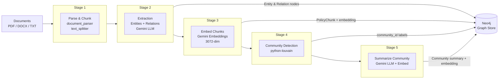
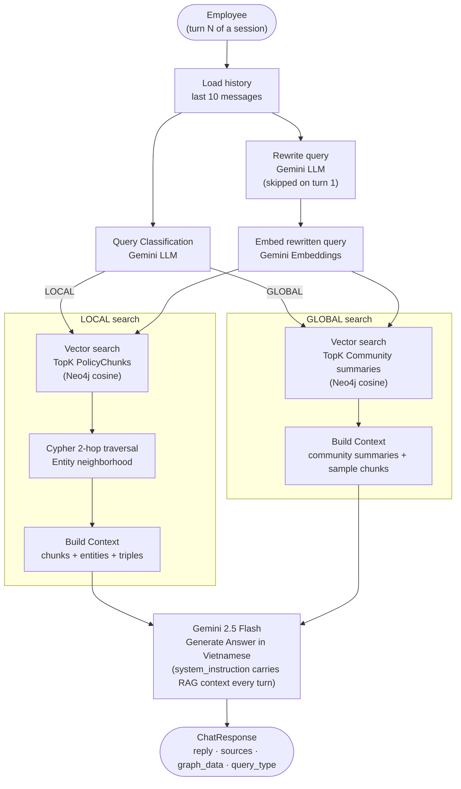

# Company Policy Assistant – Agentic House

An intelligent question-answering system for company policies and regulations, built with **Graph RAG** (Retrieval-Augmented Generation with knowledge graph). Unlike traditional search systems, Graph RAG understands the **relationships** between policies, departments, roles, and processes.

---

## System Architecture

### System Overview


### Indexing Pipeline (5 Stages)



### Query Flow (LOCAL / GLOBAL)



### Query Types

| Type | When | How |
|------|------|-----|
| **LOCAL** | Specific questions (number of vacation days, dress code by department) | Vector search chunks → Cypher 2-hop traversal → answer with citations |
| **GLOBAL** | General questions, summaries, policy comparisons | Vector search community summaries → synthesized answer |

> **Answer Verification** — when `ENABLE_ANSWER_VERIFICATION=true` (default), a second LLM call checks that the generated answer is grounded in the retrieved context before returning the response.

### Multi-Turn Conversation Quality

Three mechanisms keep answer quality high across a long conversation:

| Mechanism | How it works |
|---|---|
| **Query rewriting** | Before embedding, Gemini rewrites vague follow-ups ("Còn nhân viên thử việc?") into a standalone, context-rich query using recent conversation history. No extra LLM call on turn 1. |
| **System instruction** | The RAG context (policy documents) is passed as `system_instruction` in every Gemini chat turn, so the model always has the retrieved evidence — not just on the first message. |
| **History windowing** | Only the last 10 messages (5 turns) are sent to the LLM, preventing context bloat and conflicting information from old turns. |

---

## Tech Stack

| Layer | Technology |
|-------|-----------|
| Backend | FastAPI + Uvicorn (Python 3.12) |
| LLM (default) | Google Gemini 2.5 Flash |
| LLM (alternative) | OpenAI GPT-4.1 — set `LLM_PROVIDER=openai` |
| Embeddings (Gemini) | `models/gemini-embedding-exp-03-07` (3072 dims) |
| Embeddings (OpenAI) | `text-embedding-3-large` |
| Graph + Vector Store | **Neo4j 5** (replaces both ChromaDB + NetworkX) |
| Community Detection | python-louvain (results stored in Neo4j) |
| Frontend | React 18 + TypeScript + Vite + Tailwind CSS |
| State | Zustand |
| Container | Docker + Docker Compose |

---

## Project Structure

```
graphrag-assistant/
├── backend/
│   ├── app/
│   │   ├── main.py                    # FastAPI app + service initialization
│   │   ├── config.py                  # Configuration from .env
│   │   ├── dependencies.py            # FastAPI dependency injection
│   │   ├── api/routes/
│   │   │   ├── session.py             # POST/DELETE /session
│   │   │   ├── chat.py                # POST /chat, GET /chat/{id}/history
│   │   │   ├── admin.py               # POST /index, GET /stats, POST /ingest
│   │   │   └── graph.py               # GET /graph/nodes, GET /graph/community/{id}
│   │   ├── models/                    # Pydantic schemas
│   │   ├── services/
│   │   │   ├── llm_service.py         # LLM provider abstraction (Gemini / OpenAI)
│   │   │   ├── embedding_service.py   # Embedding provider abstraction
│   │   │   ├── neo4j_store.py         # Neo4j: graph + vector index (KEY FILE)
│   │   │   ├── indexing_service.py    # 5-stage indexing pipeline
│   │   │   ├── graph_rag_service.py   # LOCAL / GLOBAL query pipeline
│   │   │   └── session_service.py     # In-memory sessions
│   │   ├── prompts/                   # Vietnamese prompts
│   │   └── utils/                     # Document parser + text splitter
│   ├── data/raw/
│   │   ├── handbooks/                 # Employee handbooks
│   │   ├── hr_policies/               # HR policies
│   │   ├── conduct/                   # Code of conduct, dress code
│   │   ├── benefits/                  # Benefits
│   │   └── procedures/                # Procedures
│   ├── scripts/
│   │   └── build_graph_index.py       # Offline indexing CLI
│   ├── requirements.txt
│   ├── Dockerfile
│   └── .env.example
├── frontend/
│   ├── src/
│   │   ├── components/
│   │   │   ├── chat/                  # ChatWindow, ChatInput, MessageBubble
│   │   │   ├── layout/                # AppShell, Header
│   │   │   └── sources/               # SourcesPanel, SourceCard
│   │   ├── hooks/                     # useChat, useSession, useScrollToBottom
│   │   ├── store/                     # Zustand (chat + session)
│   │   ├── api/                       # Axios API layer
│   │   └── types/                     # TypeScript interfaces
│   ├── package.json
│   ├── Dockerfile
│   └── nginx.conf
└── docker-compose.yml
```

---

## Quick Start

### Requirements

- Python 3.12+
- Node.js 20+
- Docker & Docker Compose
- Google API Key (Gemini) **or** OpenAI API Key — depending on your chosen `LLM_PROVIDER`

### 1. Environment Configuration

```bash
cd backend
cp .env.example .env
```

Edit `.env` and choose your LLM provider:

**Option A — Google Gemini (default)**
```ini
LLM_PROVIDER=gemini
GOOGLE_API_KEY=your_google_api_key_here
```

**Option B — OpenAI**
```ini
LLM_PROVIDER=openai
OPENAI_API_KEY=your_openai_api_key_here
```

> **Important:** `EMBEDDING_DIM` and the embedding model are baked into the Neo4j vector index on first build. If you switch providers after indexing, delete the Neo4j volume and rebuild the graph index.

### 2. Install Dependencies

```bash
python -m venv venv
source venv/bin/activate   # macOS/Linux
pip install -r requirements.txt
```

### 3. Start Neo4j

```bash
docker compose up neo4j -d
# Wait for Neo4j to be ready (~30 seconds)
# Neo4j Browser UI: http://localhost:7474
```

### 4. Add Policy Documents

Place PDF, DOCX, or TXT files in these folders:

```
backend/data/raw/handbooks/       ← Employee handbooks
backend/data/raw/hr_policies/     ← HR policies (vacation, WFH...)
backend/data/raw/conduct/         ← Code of conduct, dress code
backend/data/raw/benefits/        ← Benefits, allowances
backend/data/raw/procedures/      ← Procedures for requests, onboarding...
```

> Pre-loaded with 6 sample Vietnamese documents for testing.

### 5. Build Knowledge Graph Index

```bash
cd backend
python -m scripts.build_graph_index
```

Expected output:
```
Initializing services...
Starting indexing pipeline...
  parsing [N/N]
  extracting [N/N]
  embedding_chunks [N/N]
  community_detection [1/1]
  summarizing [K/K]

=== Indexing Complete ===
  Chunks:      N
  Entities:   M
  Relations:    P
  Communities: K
  Summaries:    K
```

### 6. Start Backend

```bash
uvicorn app.main:app --reload --port 8000
```

Verify: `GET http://localhost:8000/health` → `{"status": "ok"}`

### 7. Start Frontend

```bash
cd ../frontend
npm install
npm run dev
```

Open **http://localhost:5173**

---

## Docker (Recommended for Production)

```bash
# Create .env at root directory (Gemini example — set LLM_PROVIDER=openai for OpenAI)
echo "LLM_PROVIDER=gemini" > .env
echo "GOOGLE_API_KEY=your_key_here" >> .env

docker compose up --build
```

| Service | URL |
|---------|-----|
| Frontend | http://localhost:5173 |
| Backend API | http://localhost:8000 |
| Neo4j Browser | http://localhost:7474 |
| API Docs | http://localhost:8000/docs |

> **Note:** After Docker starts, you still need to run the indexing pipeline:
> ```bash
> docker compose exec backend python -m scripts.build_graph_index
> ```

---

## Example Questions

**LOCAL** (specific questions):
- `"What can the IT Department wear on Monday?"`
- `"How many vacation days does an employee get after 5 years of service?"`
- `"How is overtime pay calculated on holidays?"`
- `"What are the steps in the maternity leave request process?"`

**GLOBAL** (general questions):
- `"Summarize the company's entire benefits policy"`
- `"Compare vacation rights across employee levels"`
- `"What policies does the company have to support remote work?"`

---

## Configuration

All settings in `backend/.env`:

### LLM Provider

| Variable | Default | Description |
|----------|---------|-------------|
| `LLM_PROVIDER` | `gemini` | Provider selection: `gemini` or `openai` |

### Google Gemini (used when `LLM_PROVIDER=gemini`)

| Variable | Default | Description |
|----------|---------|-------------|
| `GOOGLE_API_KEY` | — | **Required.** Google Cloud API key with Gemini access |
| `GEMINI_MODEL` | `gemini-2.5-flash` | LLM model name |
| `GEMINI_EMBEDDING_MODEL` | `models/gemini-embedding-exp-03-07` | Embedding model |
| `EMBEDDING_DIM` | `3072` | Embedding dimension (must match the model) |

### OpenAI (used when `LLM_PROVIDER=openai`)

| Variable | Default | Description |
|----------|---------|-------------|
| `OPENAI_API_KEY` | — | **Required.** OpenAI API key |
| `OPENAI_MODEL` | `gpt-4.1` | LLM model name |
| `OPENAI_EMBEDDING_MODEL` | `text-embedding-3-large` | Embedding model |

### Neo4j

| Variable | Default | Description |
|----------|---------|-------------|
| `NEO4J_URI` | `bolt://localhost:7687` | Neo4j Bolt connection URI |
| `NEO4J_USER` | `neo4j` | Neo4j username |
| `NEO4J_PASSWORD` | `techviet2024` | Neo4j password (must match `docker-compose.yml`) |

### Indexing & Retrieval Tuning

| Variable | Default | Description |
|----------|---------|-------------|
| `CHUNK_SIZE` | `2800` | Characters per chunk (~700 tokens in Vietnamese) |
| `CHUNK_OVERLAP` | `400` | Overlap between consecutive chunks |
| `ENTITY_EXTRACTION_BATCH` | `5` | Chunks processed per LLM batch during extraction |
| `MAX_LOCAL_CHUNKS` | `8` | Top-K chunks for LOCAL search |
| `MAX_COMMUNITY_SUMMARIES` | `5` | Top-K community summaries for GLOBAL search |
| `GRAPH_HOP_DEPTH` | `2` | Cypher 2-hop traversal depth for entity expansion |
| `ENABLE_ANSWER_VERIFICATION` | `true` | Run an LLM self-check after answer generation |

### Session & CORS

| Variable | Default | Description |
|----------|---------|-------------|
| `SESSION_TTL_SECONDS` | `3600` | Session idle timeout (1 hour) |
| `CORS_ORIGINS` | `["http://localhost:5173","http://localhost:3000"]` | Allowed CORS origins (JSON list) |

---

## QC Test Suite

`backend/qc_tests.py` covers five sections. Run from the `backend/` directory (with the venv activated):

```bash
python qc_tests.py                              # all sections
python qc_tests.py --section neo4j              # verify Neo4j connection & schema
python qc_tests.py --section retrieval          # test vector + graph retrieval
python qc_tests.py --section api                # integration tests against running backend
python qc_tests.py --section eval               # LLM-as-judge golden QA (costs API calls)
python qc_tests.py --section manual             # print manual test prompts
python qc_tests.py --output report.csv          # export results to docs/report.csv
python qc_tests.py --section api --output api.csv  # combine section + export
```

Use `--output FILE` to export results as CSV (columns: `name`, `passed`, `message`, `detail`). A plain filename is saved under `backend/docs/`; an absolute path is used as-is.

> The `eval` section reads golden Q&A pairs from `backend/data/eval_questions.json` and `eval_conversation_sets.json`. It scores answers using the LLM as judge — expect a small cost.

---

## Neo4j Schema

### Node Labels
- `PolicyChunk`: Text segments from documents (with embedding)
- `Entity`: Knowledge entities (POLICY, RULE, DEPARTMENT, ROLE, PROCEDURE, BENEFIT, EXCEPTION)
- `Community`: Topic groups (with embedding of summary)

### Relationship Types
- `MENTIONS`: PolicyChunk → Entity
- `BELONGS_TO_COMMUNITY`: Entity → Community
- `APPLIES_TO`, `EXEMPTS`, `OVERRIDES`, `REFERENCES`, `REQUIRES`, `PROVIDES`, `ENFORCED_BY`: Entity → Entity

### Vector Indexes
- `policy_chunks` on `PolicyChunk.embedding` (cosine, 3072 dims)
- `community_summaries` on `Community.embedding` (cosine, 3072 dims)
