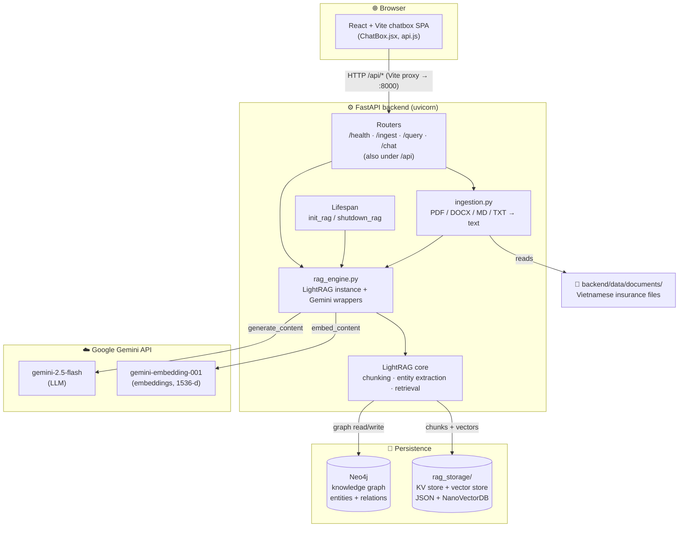
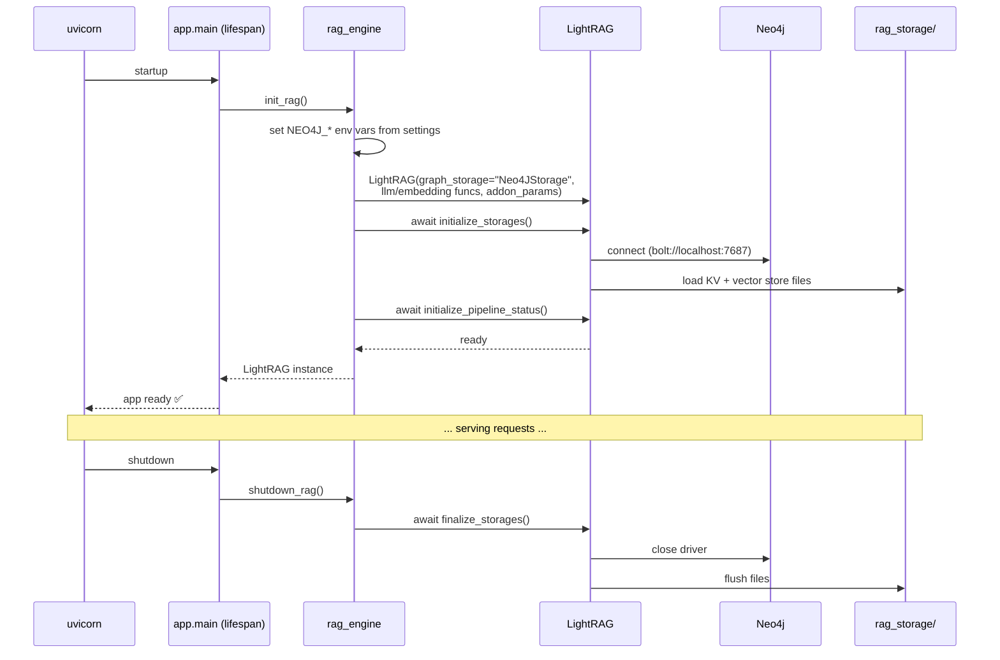
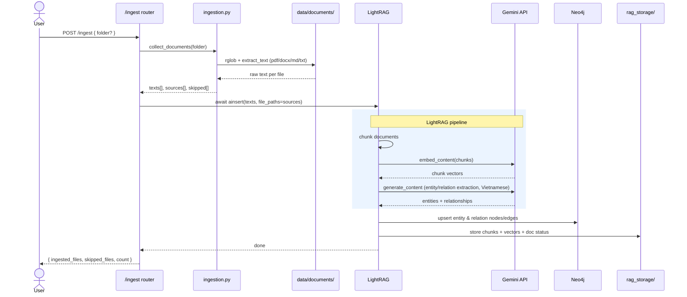
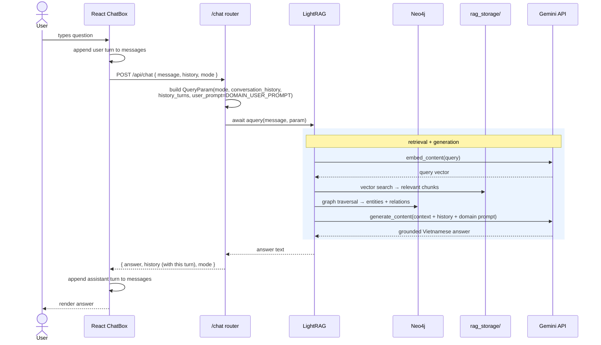
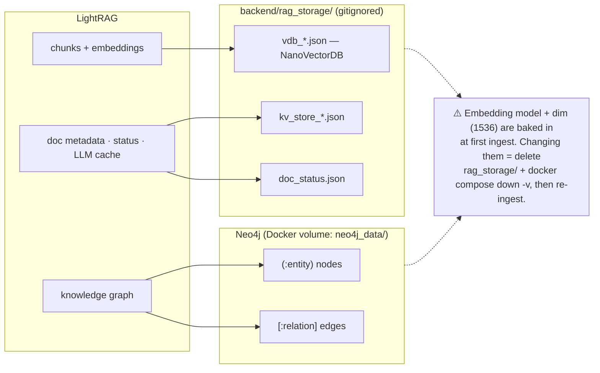
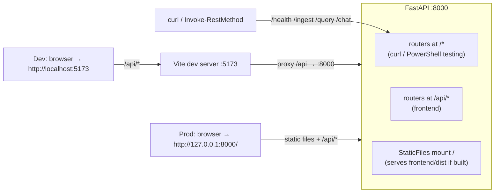

# Architecture — Vietnam Insurance Assistant

Mermaid diagrams of the system structure and its main runtime flows.

---

## 1. System components

How the pieces fit together at runtime.

---

## 2. Startup & shutdown lifecycle

LightRAG needs async initialization — wired into FastAPI's `lifespan`.

---

## 3. Document ingestion flow

`POST /ingest` — builds the knowledge graph from documents.

---

## 4. Chat / query flow

`POST /chat` — multi-turn, history owned by the browser (stateless server).

---

## 5. Storage model

What lives where, and what a reset touches.

---

## 6. Request routing

Every router is mounted twice so both direct calls and the Vite proxy work.

