# Company Policy Virtual Assistant — High-Level Design

## Architecture Overview

```mermaid
flowchart TD
    subgraph Client["Client Layer"]
        FE["React SPA\n(Vite :5173 dev / static prod)"]
    end

    subgraph Backend["Backend — FastAPI :8000"]
        MW["CORS Middleware"]

        subgraph Routers["Routers"]
            R1["POST /ingest"]
            R2["POST /ingest/upload\n(multipart + doc_type)"]
            R3["POST /chat"]
            R4["GET /health"]
            R5["GET /admin/stats"]
        end

        subgraph CtxEng["Context-Engineering Layer (cross-cutting)"]
            DOM["domains.py\nsingle source of truth\n(10 domains, schema invariant)"]
            PRM["prompts.py\ncentral prompts · grounding +\ncitation contract · language"]
            BUD["context_budget.py\ntoken-aware truncation\n+ prompt-size logging"]
        end

        subgraph Orchestrator["OrchestratorAgent"]
            CLS["classify_domains()\nGemini response_schema\n+ recent history → domain keys"]
            ROUTE["Route: none → greeting\nsingle → direct\ncross-domain → fan-out"]
            SYNTH["_synthesize()\nbudgeted merge of answers"]
        end

        subgraph Agents["Domain Specialist Agents (10)"]
            subgraph LAgents["LightRAG (hybrid/global)"]
                HR["HRPolicyAgent · hr_policies/"]
                PRO["ProceduresAgent · procedures/"]
                HB["HandbookAgent · handbooks/"]
                TRN["TrainingAgent · training/"]
            end
            subgraph PAgents["PageIndex (tree navigation)"]
                BEN["BenefitsAgent · benefits/"]
                CON["ConductAgent · conduct/"]
                MED["MedicalAgent · medical/"]
                ITS["ITSecurityAgent · it_security/"]
                CMP["ComplianceAgent · compliance/"]
                FIN["FinanceAgent · finance/"]
            end
        end

        subgraph Services["Services"]
            LSVC["LightRAGService\nquery + retrieve_entities()\n(per-domain instance)"]
            PSVC["PageIndexService\nnav → grounded answer\n(history + persona threaded)"]
        end
    end

    subgraph Storage["Storage Layer"]
        NEO4J[("Neo4j\nGraph DB · Entities + Relations\n(shared, one per domain working_dir)")]
        LDIR[("rag_storage/lightrag/\n{hr_policy, procedures,\nhandbook, training}/")]
        PDIR[("rag_storage/pageindex/\n{benefits, conduct, medical, it_security,\ncompliance, finance}/ · *.json + registry.json")]
        DOCS[("data/documents/\n10 doc_type sub-folders")]
    end

    subgraph Gemini["Google Gemini API"]
        GLLM["LLM\ngemini-2.5-flash"]
        GEMB["Embeddings\ngemini-embedding-001"]
    end

    %% Client → Backend
    FE -->|"HTTP /api/*"| MW
    MW --> Routers

    %% Context-engineering layer feeds orchestrator + agents
    DOM -.->|"domain keys"| CLS
    PRM -.->|"prompts + grounding"| CLS & SYNTH & Agents & PSVC
    BUD -.->|"budget + log"| SYNTH & PSVC

    %% Ingest
    R1 --> Agents
    R2 -->|"doc_type → domain"| Agents
    Agents --> DOCS

    %% Chat
    R3 --> CLS
    CLS -->|"response_schema JSON"| GLLM
    CLS --> ROUTE
    ROUTE --> LAgents & PAgents
    HR & PRO & HB & TRN --> LSVC
    BEN & CON & MED & ITS & CMP & FIN --> PSVC
    SYNTH -->|"Gemini merge"| GLLM

    %% Storage
    LSVC <-->|"graph read/write"| NEO4J
    LSVC <-->|"vector + KV"| LDIR
    PSVC <-->|"JSON trees"| PDIR

    %% External
    LSVC -->|"google-genai SDK"| GLLM
    LSVC -->|"google-genai SDK"| GEMB
    PSVC -->|"google-genai SDK"| GLLM

    %% Health
    R4 --> Orchestrator
    R5 --> Orchestrator
```



## Domain → Engine Mapping

All 10 domains are declared in one place — [`backend/app/domains.py`](backend/app/domains.py) — which the API schema, classifier prompt, and ingest map all derive from.

| Agent | Domain Key | Engine | Best For |
|-------|-----------|--------|----------|
| HRPolicyAgent | `HR_POLICY` | LightRAG (hybrid) | Relational: leave, hours, entitlements, roles |
| BenefitsAgent | `BENEFITS` | PageIndex | Precise: salary bands, insurance amounts, page citations |
| ConductAgent | `CONDUCT` | PageIndex | Precise: exact rules, prohibited behaviors, section refs |
| ProceduresAgent | `PROCEDURES` | LightRAG (hybrid) | Relational: steps, approval chains, responsible roles |
| HandbookAgent | `HANDBOOK` | LightRAG (global) | Broad: culture, mission, company overview |
| MedicalAgent | `MEDICAL` | PageIndex | Precise: reimbursement, coverage limits, hospital lists |
| ITSecurityAgent | `IT_SECURITY` | PageIndex | Precise: device use, passwords, access rules |
| ComplianceAgent | `COMPLIANCE` | PageIndex | Precise: labor law, PDPA, anti-corruption clauses |
| FinanceAgent | `FINANCE` | PageIndex | Precise: expense caps, reimbursement, approval limits |
| TrainingAgent | `TRAINING` | LightRAG (hybrid) | Relational: career paths, programs, eligibility, budgets |

## Context-Engineering Layer

Cross-cutting modules that shape what reaches the LLM and how its output is consumed:

| Module | Responsibility |
|--------|----------------|
| [`app/domains.py`](backend/app/domains.py) | Single source of truth for the domain set; startup invariant keeps `schemas.DomainKey` in sync |
| [`app/prompts.py`](backend/app/prompts.py) | All prompts; shared grounding + citation contract; output language driven by `settings.response_language` |
| [`app/context_budget.py`](backend/app/context_budget.py) | Token-aware truncation / section-dropping + prompt-size logging (replaces ad-hoc char slices) |
| `schemas.DomainClassification` / `GroundedAnswer` / `TreeNavigation` | Gemini `response_schema`s — the model can only emit valid shapes/domain keys |

## Query Flow

```text
POST /chat { message, history }
  │
  ▼
OrchestratorAgent.process_message()
  │
  ├── _trim_history()  (count user turns, not blind slice)
  │
  ├── classify_domains(message, history)
  │     └── Gemini response_schema=DomainClassification (temp=0)
  │           → ["BENEFITS"] | ["HR_POLICY","BENEFITS"] | []
  │           (on error → safe fallback ["HR_POLICY","HANDBOOK"])
  │
  ├── no domain (greeting / off-topic) ──→ friendly prompt
  ├── domains not yet indexed           ──→ "please upload docs"
  │
  ├── single domain ──→ agent.answer(q, history) ──→ ChatResponse
  │
  └── cross-domain
        ├── asyncio.gather(agent.answer(q, history) …)
        └── _synthesize() → rank · cap (max_docs) · fit_sections(budget)
              → Gemini merge → ChatResponse
                 { answer, domains_consulted, citations, entities }

agent.answer():
  • LightRAG → query(history, system_prompt) + retrieve_entities()  → entities
  • PageIndex → nav (TreeNavigation schema) → grounded answer
               (GroundedAnswer schema, persona + history threaded)  → citations
```

## Ingestion Flow

```
POST /ingest/upload (files[], doc_type="benefits")
  │
  ├── Save files to data/documents/benefits/
  ├── domain = DOC_TYPE_TO_DOMAIN["benefits"] → "BENEFITS"
  └── BenefitsAgent.index_document(path)
        └── PageIndexService.index_document(path)
              ├── Run PageIndex CLI (asyncio.to_thread)
              ├── Produces JSON tree → rag_storage/pageindex/benefits/{stem}.json
              └── Update registry.json

POST /ingest/upload (files[], doc_type="hr_policies")
  │
  └── HRPolicyAgent.index_document(path)
        ├── extract_text(path) → plain text
        └── LightRAGService.insert([text], [path])
              └── LightRAG.ainsert() → Neo4j + rag_storage/lightrag/hr_policy/
```

## Frontend Components

```
App.jsx
  ├── Header: title + agent status chips (HR Policy, Benefits, Conduct, …)
  └── ChatBox.jsx
        ├── Upload bar: doc_type selector + "Upload docs" button
        ├── Message list
        │     └── Message.jsx
        │           ├── Domain badges (e.g. [Benefits] [HR Policy])
        │           ├── Answer text
        │           └── Citation badges (doc.pdf · p.4)
        └── Input form
```

## Tech Stack

| Layer | Technology |
|-------|-----------|
| LLM | Google Gemini 2.5 Flash |
| Embeddings | gemini-embedding-001 (1536d) |
| Graph RAG | LightRAG (knowledge graph + vector hybrid) |
| Vectorless RAG | PageIndex (hierarchical tree navigation) |
| Graph DB | Neo4j 5 |
| Backend | FastAPI + Uvicorn |
| Config | Pydantic-settings |
| Frontend | React 18 + Vite |
