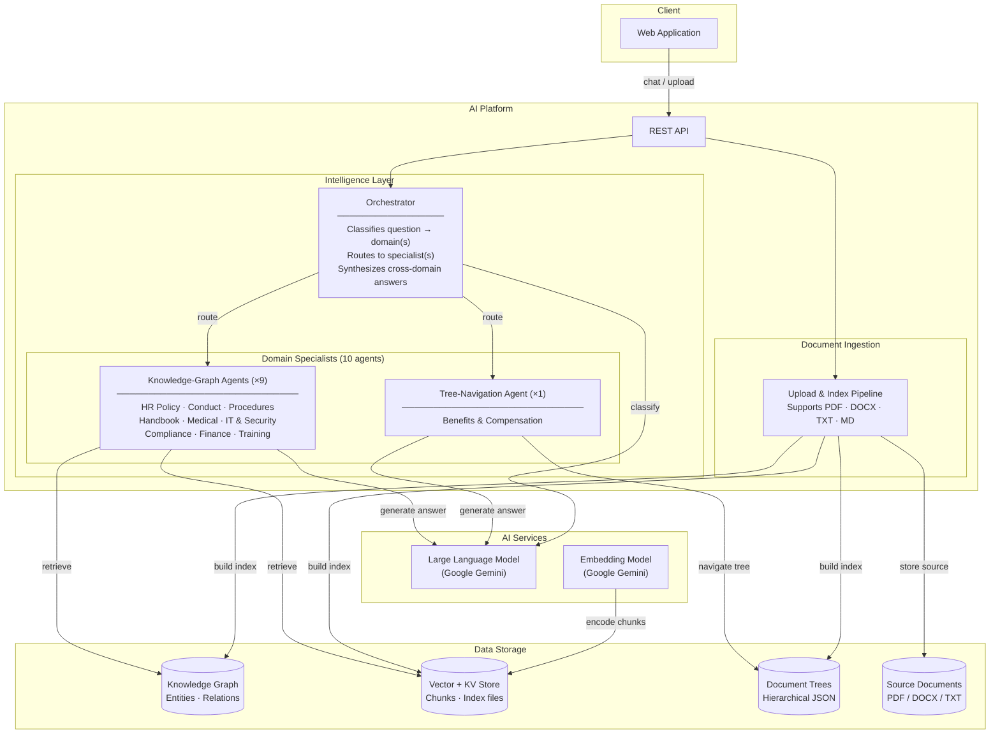
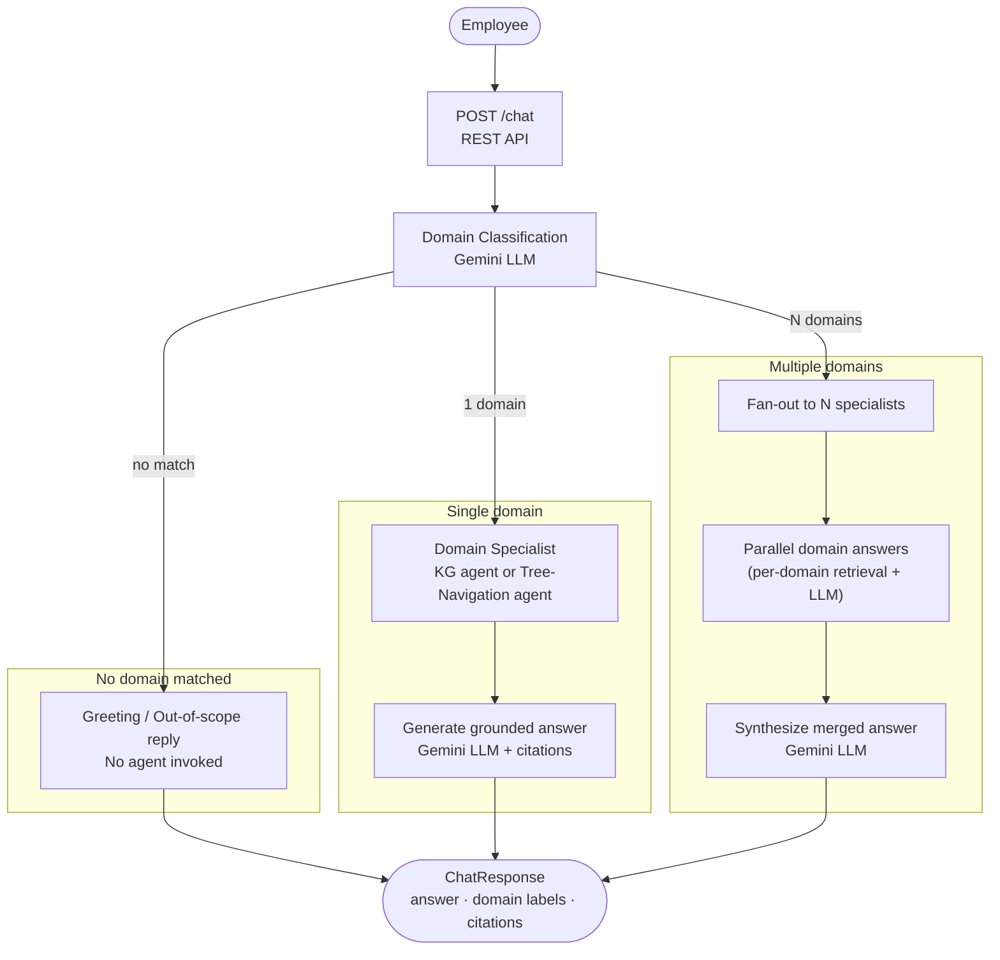
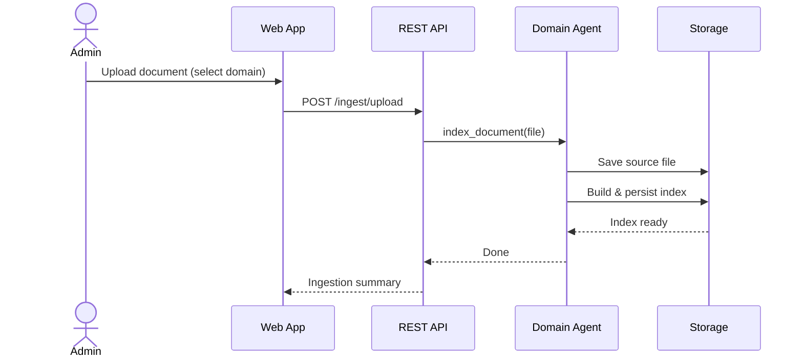

# Company Policy Virtual Assistant — High-Level Design

## System Overview

A multi-agent AI assistant that answers employee questions about company policies. Each question is automatically routed to the most relevant domain specialist(s); answers are grounded in uploaded policy documents and include source citations.

---

## Architecture

---

## Domain Coverage

| Domain | Specialist | Typical Questions |
|--------|-----------|------------------|
| HR Policy | HR Policy Agent | Leave entitlements, working hours, disciplinary procedures |
| Benefits | Benefits Agent | Salary bands, insurance coverage, allowance amounts |
| Conduct | Conduct Agent | Prohibited behaviors, conflict of interest, discipline |
| Procedures | Procedures Agent | Approval workflows, step-by-step processes |
| Handbook | Handbook Agent | Company culture, mission, onboarding overview |
| Medical | Medical Agent | Health insurance, hospital network, reimbursement |
| IT & Security | IT Security Agent | Access control, acceptable use, incident reporting |
| Compliance | Compliance Agent | Legal obligations, regulatory requirements, penalties |
| Finance | Finance Agent | Expense limits, reimbursement process, approvers |
| Training | Training Agent | Learning programs, eligibility, career development |

---

## Request Flow (Single / Multi-Domain Routing)

---

## Document Ingestion Flow

---

## Answer Quality Guarantees

| Guarantee | Mechanism |
|-----------|-----------|
| Domain accuracy | LLM-based classifier with structured output — only valid domain keys returned |
| Grounded answers | Each agent's prompt enforces citation-only responses; unsupported claims are forbidden |
| Citation traceability | Every answer includes document name, page number, and section reference |
| Language consistency | Response language is centrally configured; all agents share the same language contract |
| Context overflow prevention | Token-aware content trimming applied before every LLM call |
| Schema correctness | Structured output schemas enforce valid response shapes at the API boundary |

---

## Tech Stack

| Layer | Technology |
|-------|-----------|
| LLM & Embeddings | Google Gemini 2.5 Flash + Gemini Embedding |
| Knowledge-Graph RAG | LightRAG (graph + vector hybrid) |
| Tree-Navigation RAG | PageIndex Cloud (vectorless, hierarchical) |
| Graph Database | Neo4j 5 |
| API | FastAPI + Uvicorn |
| Frontend | React 18 + Vite |
